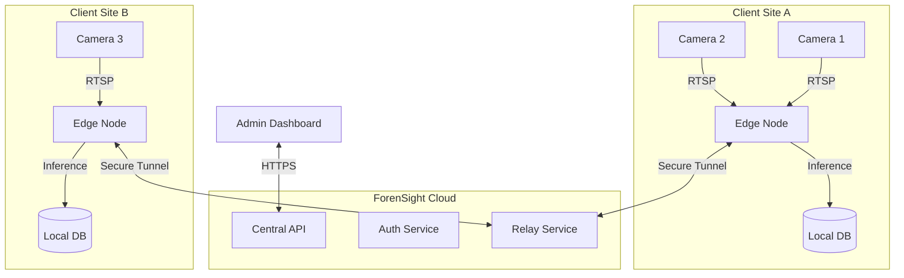

# System Architecture

ForenSight AI implements a **Decentralized Edge-First Architecture** designed to solve the critical flaws of traditional cloud-based video surveillance: **Latency**, **Bandwidth**, and **Privacy**.

## High-Level Design

The system is composed of three primary subsystems:
1.  **Edge Nodes (Clients)**: Independent processing units running on customer hardware.
2.  **Central Cloud (Server)**: Orchestration, authentication, and tunneling layer.
3.  **Relay Network**: Secure WebSocket bridges for remote access.

---

## Component Deep Dive

### 1. The Edge Application (The Brain)
This is a standalone desktop application built with **Python** and **PyQt6**. It runs fully offline and manages the entire surveillance pipeline.

*   **Ingestion Engine**: Uses `OpenCV` and `FFmpeg` to decode H.264/H.265 streams from IP cameras.
*   **Inference Loop**:
    *   Frames are pre-processed (resized, normalized).
    *   Passed through **YOLOv8** (Object Detection).
    *   If a person is detected, frames are passed to secondary models (**ArcFace** for identity, **PoseNet** for behavior).
    *   If a threat is found, an alert is generated.
*   **Data Persistence**: All metadata (timestamps, bounding boxes, vector embeddings) is stored in a local **SQLite** database. No video is ever sent to the cloud unless explicitly requested by the user for live viewing.

### 2. The Central Server (The Orchestrator)
A lightweight **FastAPI** backend that manages the business logic.

*   **Authentication**: Handles user login and session management via JWT.
*   **License Management**: Validates software licenses for Edge nodes.
*   **Signaling**: Coordinates the connection between a remote user (Web Dashboard) and a local Edge Node for live streaming.

### 3. The Relay Service (The Bridge)
A custom WebSocket server that solves the NAT traversal problem.
*   Edge Nodes maintain a persistent outbound connection to the Relay.
*   When a user requests a live view, the Relay bridges the data packets from the Edge Node to the Web Client.
*   This eliminates the need for potentially dangerous **Port Forwarding** on the client's router.

---

## Data Flow: The "Privacy-First" approach

1.  **Video Capture**: Raw video remains on the local SSD.
2.  **Analysis**: AI extracts *metadata* (e.g., "Male, Red Shirt, 10:45 AM").
3.  **Sync**: Only this lightweight metadata (KB size) is accessible to the forensic search engine.
4.  **Forensics**: When a user searches for "Red Shirt", the system queries the metadata index, not the video files, resulting in milliseconds-fast search results.
